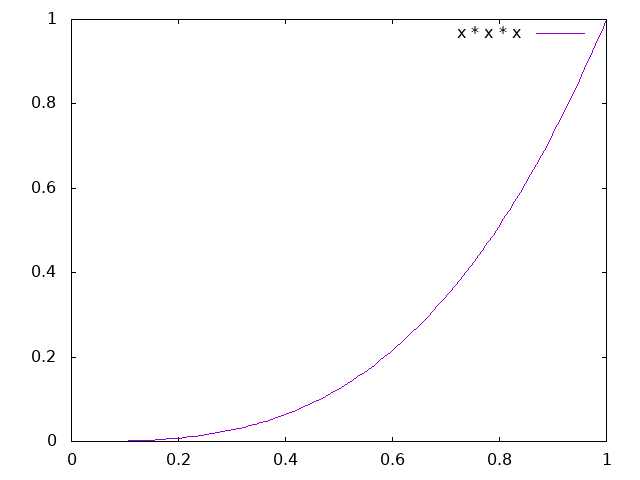

# sdPBR ストッキング材質作成講座

この文書では sdPBR 2.90 での作成方法を記述しています。  
この他のバージョンでは作成方法が異なる場合があります。

## 概説

ストッキング材質の最も重要な点は、カメラに対する面の向きによって透明度が変化することです。

ストッキングの表面を正面から見たとき、繊維の間から肌が見えるため透明度が高くなります。  
ストッキングの表面を斜めから見たとき、繊維の太さ分だけ奥の繊維との間の肌部分が見えなくなるため、透明度は低くなります。  

sdPBRの材質設定ではカメラ角度と法線の情報を参照できるため、この2つのパラメータに応じて透明度を変化させることでストッキング特有の透明度表現の実現が可能です。

しかし、sdPBRの材質設定では透明度の変更がマップ画像を通してでしかできません。  
また、材質設定の適用時点では法線マップの適用前に法線情報が渡されます。  
そのため、sdPBRmain.fxsubを編集して法線マップ適用後の法線情報が得られて透明度の変更も可能な関数の実行を挿入します。

## sdPBRmain.fxsubの編集

{sdPBRフォルダ}\shader\sdPBRmain.fxsub を開き、923行目付近に移動してください。  
````hlsl
    //マスクマップもここでよんどく
    ResolveMaskMapping(m, Eye, uv, spuv, Color);
    
    return cavity;
````

このように処理を書き足します。
````hlsl
    //マスクマップもここでよんどく
    ResolveMaskMapping(m, Eye, uv, spuv, Color);

    // ここから書き足し
    #ifdef CUSTOMIZE_COLOR
        CostomizeColor(m, Eye, v, n, face, uv, spuv, Color);
    #endif
    // ここまで
    
    return cavity;
````

## ストッキング材質の作成

適当なフォルダにストッキング材質を作成します。  
この文書では以下の場所に作成したものとして説明を行います。
````
{sdPBRフォルダ}\materialSpecific\{モデル名}\stocking.fx
````
`{モデル名}`としてモデルごとにフォルダを分けることで材質を整理しています。  
`{sdPBRフォルダ}`から2階層下のディレクトリにファイルが存在すれば、元から提供されている材質ファイルの流用が簡単です。

`stocking.fx`に`{sdPBRフォルダ}\material\cloth\sdPBR_stocking.fx`の中身をコピーします。  
````hlsl
#define SDPBR_MATERIAL_VER 100
#include "../../shader/sdPBRMaterialHead.fxsub"

void SetMaterialParam(inout Material m, float3 n,float3 l, float3 Eye, float2 uv)
{
    m.subsurface = 0.8;
    m.roughness = 0.8;
    m.specular = 0.5;
    m.sheen = 1;
    m.sheenTint = 1;
    m.anisotropic = 1;
    m.metallic = 0.1;
    m.normalLoops = 15;
    m.normalScale = 0.3;
}

#define NORMAL_FROM NORMAL_FROM_FILE
#define NORMAL_FILE "../../texture/Fabric032_2K_Normal.jpg"

#include "../../shader/sdPBRMaterialTail.fxsub"
````

次に、`SetMaterialParam`関数の下にストッキングの透過処理を追加します。
````hlsl
#define SDPBR_MATERIAL_VER 100
#include "../../shader/sdPBRMaterialHead.fxsub"

void SetMaterialParam(inout Material m, float3 n,float3 l, float3 Eye, float2 uv)
{
    m.subsurface = 0.8;
    m.roughness = 0.8;
    m.specular = 0.5;
    m.sheen = 1;
    m.sheenTint = 1;
    m.anisotropic = 1;
    m.metallic = 0.1;
    m.normalLoops = 15;
    m.normalScale = 0.3;
}

// ここから追加
#define CUSTOMIZE_COLOR
void CostomizeColor(in Material m, float3 Eye, float3 v, in float3 n, float face, in float2 uv, float2 spuv, inout float4 Color)
{
    float3 nNml = normalize(n);
    float3 nEye = normalize(Eye);
    float inpro = nNml.x * nEye.x + nNml.y * nEye.y + nNml.z * nEye.z;
    float gInpro = pow(abs(inpro), 3);

    float ratio = lerp(1, 0.2, gInpro);

    Color.a *= ratio * 1;
}
// ここまで

#define NORMAL_FROM NORMAL_FROM_FILE
#define NORMAL_FILE "../../texture/Fabric032_2K_Normal.jpg"

#include "../../shader/sdPBRMaterialTail.fxsub"

````

これでストッキング材質は完成です。  
次の章では動作の解説を行います。

## 動作機序

### CostomizeColor内の処理
````hlsl
    float3 nNml = normalize(n);
    float3 nEye = normalize(Eye);
````
法線とカメラ角度のベクトルを正規化します。  
この処理が入らないと計算結果がおかしくなることがあります。

````hlsl
    float inpro = nNml.x * nEye.x + nNml.y * nEye.y + nNml.z * nEye.z;
````
法線とカメラ角度との間の内積を計算します。  
内積は2つのベクトルがどれくらい近いかを表しますので、カメラ角度と法線が近いほど透明度を高くしたい今回のケースでは非常に有用です。

````hlsl
    float gInpro = pow(abs(inpro), 3);
````
内積の絶対値を3乗しています。  
内積の正負は面に対してカメラが前後どちらにあるかを表しますが、今回はその情報は不要な上、計算の都合上邪魔になるため絶対値をとっています。

内積の絶対値をそのまま使用してもいいのですが、その場合カメラ角度と法線の角度差に対して線形に透明度が変化することになります。  
例えるなら、MMDの補間曲線が直線になっているときのような透明度変化になります。  
そこで、内積を3乗することにより曲線的に値が変化するようにしています。

絶対値をそのまま使った場合の透明度変化


絶対値の3乗を使った場合の透明度変化


````hlsl
float ratio = lerp(1, 0.2, gInpro);
````

`lerp`関数は第3引数の 0 -> 1 を 第1引数 -> 第2引数 に線形に変換してくれる関数です。  
この式では以下のような変換になります。
| gInpro |     | ratio |
| :----: | :-: | :---: |
|  0.0   | →  |  1.00 |
|  0.2   | →  |  0.84 |
|  0.4   | →  |  0.68 |
|  0.6   | →  |  0.52 |
|  0.8   | →  |  0.36 |
|  1.0   | →  |  0.20 |

第1引数によって真横から見たときに完全不透明状態にすることができます。  
第2引数によって真正面から見たときの透明度を決められます。今回は`0.2`なので、薄い半透明くらいになります。

````hlsl
    Color.a *= ratio * 1;
````
現在の描画位置における透明度に対し、`ratio`をかけた値を再代入しています。  
` * 1`の数値を変えることで、全体的な透明度を調整することができます。

`CostomizeColor`関数内での処理によって透明度の他、Colorのメンバ変数を変更することで色の変更も可能です。  
今回は使用しませんでしたが、材質情報の数値も利用できるので、テクスチャの特定の色に応じて透明度を変えるなどの芸当も可能です。
基本的にはこの関数ないで処理を書けばいろいろなことができると思います。

ここからは補足的なことについて軽くまとめておきました。
### 編集したファイルの関係性
各種材質エフェクトファイルには、上部と下部にそれぞれ`#include`文が書かれています。

````hlsl
#include "../../shader/sdPBRMaterialHead.fxsub"

/* 材質設定 */

#include "../../shader/sdPBRMaterialTail.fxsub"
````

`{sdPBRフォルダ}\shader\sdPBRMaterialTail.fxsub`は以下のような内容になっています。
````hlsl
#include "../../shader/sdPBRmain.fxsub"
````
つまり、材質設定のfxファイルの最後に`sdPBRmain.fxsub`の内容が付加されてエフェクトデータにコンパイルされます。

### CUSTOMIZE_COLORの定義

今回は関数の呼び出し処理を追加しているため、`sdPBRmain.fxsub`にそのまま処理を追加するとすべての材質に関数を定義する必要が生じます。  
そこで`#ifdef`文を使用することで、他のファイルに影響を与えることなく処理の追加が可能になっています。  
`#define CUSTOMIZE_COLOR`と記述された材質でのみ関数呼び出し処理が走るようになるためです。

